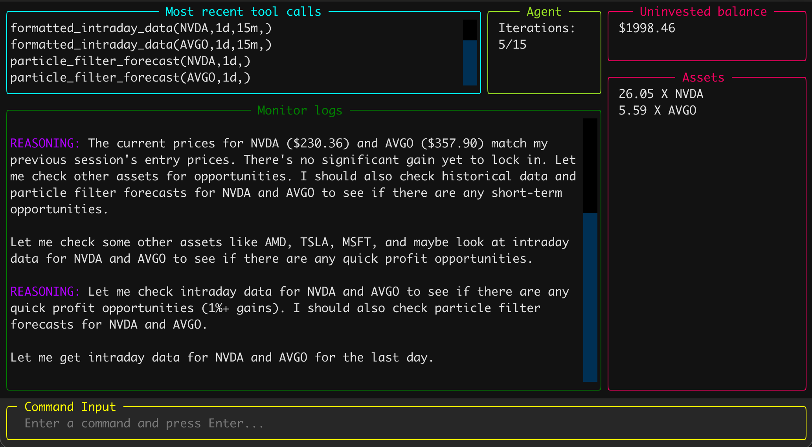

# Octagon

> Leave your agent trading on your computer while you work

Octagon is your agentic trader. It monitors the market and trades on your behalf.
Differently from other available tools, octagon carries a set of tools that helps the agent to better 
analyze and understand the market, and act like a quantitative trader.

Besides basic market and historical data, Octagon calculates the Fama French Factors, Kalman fair values,
Markov Chain regimes, and estimates short term prices with particle filters. Additionally, it analyzes
market sentiment from the web.

<div align="center">

</div>

## Usage

Octagon offers a straightforward terminal interface for easy agent observability. To start it,
run the following:

```
git clone https://github.com/LucasSte/octagon
cd octagon
pip install .
python3 octagon_trade.py
```

The project has been conceived to run with local models, so you can have unlimited tokens, and run it 
during the entire trading hours. It works with OpenAI API compatible inference engines, like LMStudio or llama.cpp. 

Check [octagon_trade.py](octagon_trade.py) for the initial prompt, the endpoint and the model name.
If you wish not to execute a local model, set up the environment variable `OPENAI_API_KEY`.

Since models do not have infinite context window, you also define in [octagon_trade.py](octagon_trade.py) the
number of iterations the agent runs for. Before finishing, it writes down session summary in `memory.json` 
and loads it again for the next session.

Use `save` and `load` to save and restore the trading portfolio between sessions, and type `help` for all the
available commands.

### Adding new tools

Trading strategies may vary between people. If you want to customize trading decisions and data sources, the best way 
to do so is to add a new tool. Follow these steps to include new functionality:

1. If your new tool does not fit in any of the available categories (analysis, assets, market data and utilities under
   `octagon/tools`), create a new Python module in `octagon/tools`.
2. Implement your new functionality.
3. Create the tool description and the dispatch dictionary in `metadata.py`. See the example in 
   [market_data/metadata.py](octagon/tools/market_data/metadata.py).
4. Register your tool in [registration.py](octagon/tools/registration.py).
5. If your functionality requires a state to be stored between calls, implement a class and create the dispatch 
   dictionary with an active instance of it. See the usages of `Portfolio.build_dispatch_dict` 
   declared in [portfolio.py](octagon/tools/assets/portfolio.py) as guidance.

## Benchmarks

We ran the trading benchmark between September 14 and September 18, 2026. The repository state was commit
[103c5f4](https://github.com/LucasSte/octagon/tree/103c5f42ef7177de064b066ce99ed2abb5d8c9e3). The assets available
for the agent are described in [assets.py](https://github.com/LucasSte/octagon/blob/103c5f42ef7177de064b066ce99ed2abb5d8c9e3/octagon/tools/assets/available_assets.py#L10-L27). For the LLM, we used LMStudio with Qwen3.8-27b 6-bit running on a 
MacBook Pro M3 Max with 48 GB of RAM.

The memory recorded and the portfolio state for each trading session (two to four sessions every day) are available in 
the [benchmarks](benchmarks) folder. It contains a screenshot of the portfolio value on market close for each day.

The results for are in the table below. The agent started with $10,000 on Monday.

| Date         | Portfolio value | Day change      | Accumulated gain |
|--------------|-----------------|-----------------|------------------|
| Start        | $10,000.00      | -               | -                |
| September 14 | $10,068.41      | +68.41 (0.68%)  | +68.41 (0.68%)   |
| September 15 | $10,053.53      | -14.88 (-0.14%) | +53.53 (0.53%)   |
| September 16 | $10,029.30      | -24.23 (-0.24%) | +24.23 (0.24%)   |
| September 17 | $10,239.95      | +210.65 (2.10%) | +239.95 (2.39%)  |
| September 18 | $10,176.02      | -63.93 (-0.62%) | +176.02 (1.76%)  |


## Leaderboard

Changes in the tooling, initial prompt and available assets will impact the agent's performance. If you've found a
configuration of tools outperforms the leaderboard below, submit a PR and with your changes, and update the 
leaderboard.

| User      | Dates                 | Gains  | Commit |
|-----------|-----------------------|--------|--------|
| @LucasSte | September 14-18, 2026 | +1.76% | [103c5f4](https://github.com/LucasSte/octagon/tree/103c5f42ef7177de064b066ce99ed2abb5d8c9e3) |

## Feature backlog

There are some ideas for the future of this project. They are going to be implemented soon, but
not necessarily in this order.

* Allow the agent to access curated news about the trading stock. News, like the announcement of earnings, may 
  influence trading decisions.
* Connect to real trading venues. One option might be connecting to blockchains, like Solana or Hyperliquid, which 
  allows the agent to trade 24/7.
* Release this project as a library on `pip`, so that it can be integrated in third party projects. This is useful
  if someone wants to create special trading strategies without needing to clone or fork this repository.
* Ability to talk to the agent in the terminal interface.
* Simulate trading with historical data.

Feature requests and bug fixes are welcomed! If you want anything else not in this list, or if you've found a bug, 
please file an issue. Also, open an issue if you want any of these backlog items prioritized.

## Limitations

1. This project came to life as a research and side project. Returns are not guaranteed, so use it at your own risk.
2. Although the agent uses real market data, all trades, balances and portfolio are simulated, so no money 
   is actually spent. No deposits can be made that allows the agent to trade with real money at this time.
